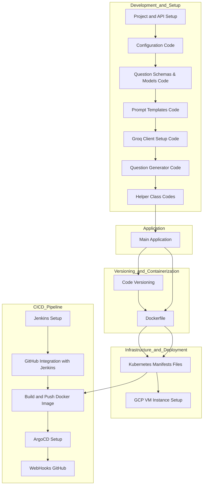

# 📘 AskGenie: AI-Powered Quiz Generator

**AskGenie** is a real-time AI-powered quiz generation app built using **Groq’s Llama 3.1 (70B)** model (`llama3-70b-8192`). Users can instantly generate topic-specific quizzes by selecting the type, difficulty, and number of questions.

This project follows full **MLOps + LLMOps** best practices — it is containerized with **Docker**, orchestrated using **Kubernetes**, and continuously deployed via **Jenkins + ArgoCD**.

---

## 📌 Features

- 🔍 **Custom Quiz Generation** - Select **topic**, **question type** (MCQ/Descriptive), **difficulty**, and **number of questions**.
- ⚙️ **Groq LLM Integration** - Powered by **Groq API** using `llama3-70b-8192` for **high-quality**, large-context, and accurate quiz generation.
- 🎯 **Clean UI with Streamlit** - Responsive and intuitive layout for seamless user interaction.
- 🐳 **Dockerized App** - Lightweight and portable container built with **Docker**.
- ☸️ **Kubernetes Deployment** - Fully scalable and deployed on a **GCP VM** via **Minikube** or **GKE**.
- 🚀 **CI/CD Pipeline** - Automated build and deployment using **Jenkins + ArgoCD**.

---

## 🧱 Architecture Overview

