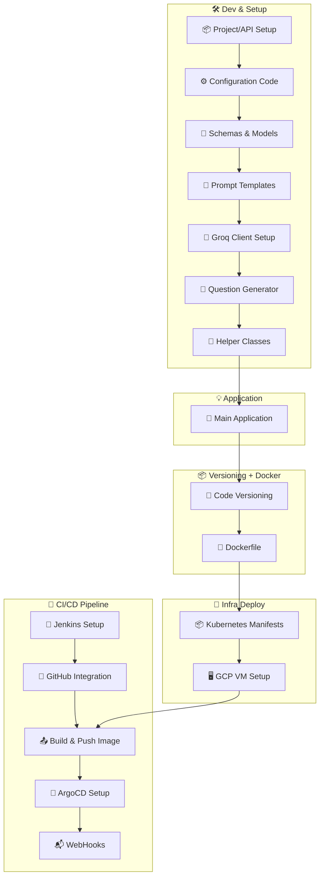
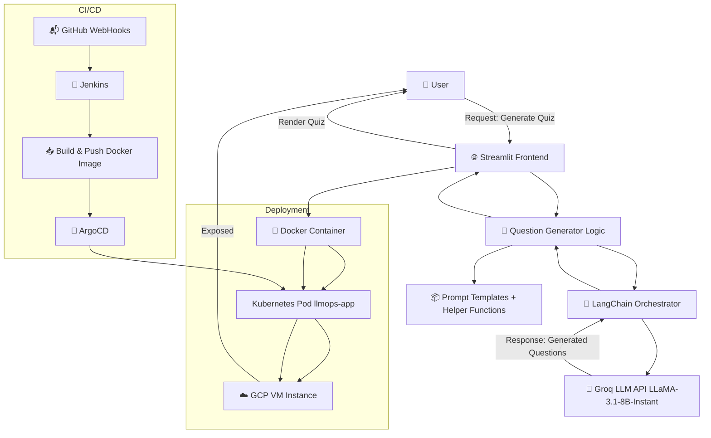

<p align="center">
  
  
  
  
  
  
  
  
  
  
</p>

<div align="center">

# 📘 AskGenie: AI-Powered Quiz Generator with LLM + LangChain + MLOps

**AskGenie** is a real-time, AI-powered quiz generator that uses **Groq’s LLaMA 3.1 (70B)** model (`llama3-70b-8192`) orchestrated via **LangChain** for generating multiple-choice and fill-in-the-blank questions.  
Users can instantly generate quizzes based on selected topic, difficulty, and question type.

The project follows full **LLMOps + MLOps** best practices — containerized with **Docker**, orchestrated using **Kubernetes**, and continuously deployed via **Jenkins + ArgoCD** on **Google Cloud Platform (GCP)**.

</div>

---
## 📚 Table of Contents
- [📌 Features](#-features)
- [🔄 Project Workflow](#-project-workflow)
- [🧱 Project Architecture](#-project-architecture)
- [✅ Step-by-step: How It Works](#step-by-step-how-it-works)
- [🧪 Inputs & Functionality](#-inputs--functionality)
- [🛠️ Tech Stack](#-tech-stack)
- [📸 Project Screenshots](#-project-screenshots)
  - [🔧 Jenkins CI/CD Pipeline](#-jenkins-cicd-pipeline)
  - [🐳 Docker Image Build](#-docker-image-build)
  - [🚀 ArgoCD Deployment](#-argocd-deployment)
  - [🎯 AskGenie App UI – Quiz Generation](#-askgenie-app-ui--quiz-generation)
- [🔧 Prerequisites](#-prerequisites)
- [🧪 Local Setup](#-local-setup)
- [🐳 Docker Build & Run](#-docker-build--run)
- [🛠️ Full CI/CD Deployment Setup Instructions](#️-full-cicd-deployment-setup-instructions)
- [🤝 Contributors](#-contributors)

---

## 📌 Features

- 🔍 **Custom Quiz Generation** – Choose **topic**, **question type** (MCQ/Fill in the Blank), **difficulty**, and **number of questions**
- ⚙️ **Groq LLM Integration** – Uses **Groq API** with `llama3-70b-8192` for fast, context-rich question generation
- 🔗 **LangChain Orchestration** – Modular and scalable LLM workflow management using **LangChain** for prompt routing and question handling
- 🎯 **Streamlit UI** – Intuitive, responsive interface for a seamless user experience
- 🐳 **Dockerized App** – Lightweight, portable, and production-ready
- ☸️ **Kubernetes Deployment** – Scalable app deployed on **GCP VM** (via Minikube or GKE)
- 🚀 **CI/CD Pipeline** – End-to-end automation with **Jenkins + ArgoCD + GitHub Webhooks**

---

## 🔄 Project Workflow


---

## 🧱 Project Architecture


---

## ✅ Step-by-step: How It Works

### 1. 🧑 User Interaction
The user opens the web interface and sends a request to generate a quiz.  
This request is handled by the **🌐 Streamlit Frontend**, which provides a clean, interactive UI.

---

### 2. 🌐 Streamlit Frontend
The frontend collects inputs like:
- **Question Type** (MCQ/Descriptive)
- **Topic** (e.g., Python, History)
- **Difficulty** (Easy, Medium, Hard)
- **Number of Questions**

It then sends this input to the **🧠 Question Generator Logic** in the backend.

---

### 3. 🧠 Question Generator Logic
This is the core engine of the app.  
It handles:
- Input validation  
- Prompt formatting  
- Calling the LLM via orchestrator  
- Parsing the response  

Internally, it uses:
- 📦 **Prompt Templates**: Pre-defined templates for consistent LLM requests  
- 🧰 **Helper Functions**: Functions for formatting, error handling, and JSON processing  
- 🔗 **LangChain**: Manages prompt handling and Groq API interaction

---

### 4. 🚀 Groq LLM API (LLaMA 3.1 8B Instant)
- LangChain sends the prompt to the **Groq API**  
- Groq uses the `LLaMA-3.1-8B-Instant` model to generate quiz questions  
- The API returns the questions in structured format (usually JSON or text)

---

### 5. 🔁 Return Flow
- The generated questions are sent back to the **Question Generator Logic**  
- They are processed and forwarded to the **Streamlit frontend**, which then:
  - Displays the questions in the UI  
  - Supports user attempts and interactivity

---

### 6. 🐳 Docker Containerization
- The entire application (code + dependencies) is packaged into a **Docker container**  
- This container is labeled something like `llmops-app` for deployment

---

### 7. ☸️ Kubernetes Deployment
- The Docker container is deployed to a **Kubernetes Pod**  
- This allows for:
  - Scalability  
  - Reliability  
  - Self-healing deployments  

- The pod runs on a **☁️ GCP VM instance**, which serves as the cloud host

---

### 8. 🔧 Jenkins CI/CD
- 📬 GitHub WebHooks notify Jenkins of every push to the repository
- **Jenkins** automates the entire CI/CD workflow:
  - Detects GitHub events via WebHook  
  - 📥 Builds & pushes the Docker image to a container registry  
  - 🚀 Triggers the ArgoCD sync process to update the deployment

---

### 9. 🚀 ArgoCD Deployment
- **ArgoCD** monitors the GitHub repo and syncs Kubernetes manifests  
- Ensures that the latest Docker image is deployed to the cluster

---

### 10. 🌐 Exposure to the User
- The **Kubernetes service** running on the GCP VM exposes the app via a **public IP or domain**  
- The user can now access the **live quiz generator app**

---

## 🧪 Inputs & Functionality
| Input Field                | Description                               |
| -------------------------- | ----------------------------------------- |
| 🧠 **Question Type**       | MCQ or Fill in the Blank                  |
| 📚 **Topic**               | Subject area like AI, History, Math, etc. |
| 🎯 **Difficulty**          | Easy / Medium / Hard                      |
| 🔢 **Number of Questions** | Choose from 1 to 10                       |

---

## 🛠️ Tech Stack
| Layer                       | Tools Used                                                                 |
| --------------------------- | -------------------------------------------------------------------------- |
| 💻 **Frontend UI**          | Streamlit (Custom styled interface with forms & question rendering)        |
| 🧠 **LLM Backend**          | Groq API (`llama3-70b-8192`)                                               |
| 🔗 **LLM Orchestration**    | LangChain (Prompt management & API calls)                                  |
| 🧪 **Backend Logic**        | Python (Modular, functional design: prompts, schemas, generators, helpers) |
| 🐳 **Containerization**     | Docker (App + dependencies as portable image)                              |
| ☸️ **Deployment**           | Kubernetes (Minikube for local, GKE for cloud)                             |
| 🔧 **CI/CD**                | Jenkins (pipeline) + GitHub (code) + 📬 WebHooks + ArgoCD (GitOps deploy)  |
| ☁️ **Cloud Infrastructure** | Google Cloud Platform (GCP VM Instance)                                    |

---
## 📸 Project Screenshots

### 🔧 Jenkins CI/CD Pipeline

- ✅ **Pipeline Start**

  

- ✅ **Pipeline Success**

  

---

### 🐳 Docker Image Build

- 📦 **Docker Images Built**

  

---

### 🚀 ArgoCD Deployment

- 🔄 **ArgoCD Sync and Health Status**

  

---

### 🎯 AskGenie App UI – Quiz Generation

- 🧠 **MCQ Question Generation – Page 1**

  

- 🧠 **MCQ Question Generation – Page 2**

  

- ✍️ **Fill-in-the-Blank Question Interface**

  

---
## 🔧 Prerequisites
Before running the project, ensure you have the following installed:
- Python 3.11+
- Docker
- Groq API Key (signup at [Groq Cloud](https://console.groq.com/))
- GCP VM or Localhost for deployment
- (Optional) Jenkins, ArgoCD if deploying CI/CD pipeline

## 🧪 Local Setup
```bash
# 1. Clone the repository
git clone https://github.com/aimldinesh/ASKGENIE.git
cd ASKGENIE

# 2. Create virtual environment & activate
python -m venv venv
source venv/bin/activate  # for Linux/macOS
venv\Scripts\activate     # for Windows

# 3. Install dependencies
pip install -e .

# 4. Set up Groq API key
echo "GROQ_API_KEY=your_key_here" > .env

# Run locally
streamlit run app.py
```
--- 

## 🐳 Docker Build & Run
```bash
# Build Docker image
docker build -t askgenie .

# Run container
docker run -p 8501:8501 askgenie
```

---

## 🛠️ Full CI/CD Deployment Setup Instructions
For detailed end-to-end deployment steps—including Docker build, Kubernetes deployment on GCP, Jenkins CI/CD pipeline, GitHub integration, ArgoCD sync, and GitOps automation—check the guide below:

[View Full Setup Instructions →](./complete_setup.md).

## 🤝 Contributors
- [Dinesh Chaudhary](https://github.com/aimldinesh)
