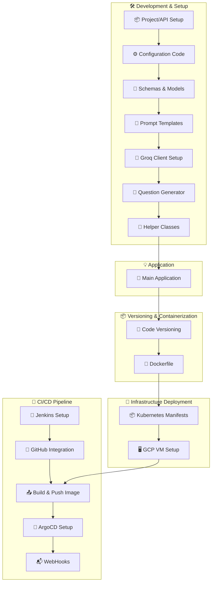

# 📘 AskGenie: AI-Powered Quiz Generator

**AskGenie** is a real-time AI-powered quiz and fill-in-the-blank generation app built using **Groq’s Llama 3.1 (70B)** model (`llama3-70b-8192`). Users can instantly generate topic-specific quizzes by selecting the type, difficulty, and number of questions.

This project follows full **MLOps + LLMOps** best practices — it is containerized with **Docker**, orchestrated using **Kubernetes**, and continuously delivered using **Jenkins + ArgoCD**.

---

## 📌 Features

- 🔍 **Custom Quiz Generation** – Choose **topic**, **question type** (MCQ/Fill in the Blank), **difficulty**, and **number of questions**
- ⚙️ **Groq LLM Integration** – Uses **Groq API** with `llama3-70b-8192` for fast, context-rich question generation
- 🎯 **Streamlit UI** – Intuitive, responsive interface for a seamless user experience
- 🐳 **Dockerized App** – Lightweight, portable, and production-ready
- ☸️ **Kubernetes Deployment** – Scalable app deployed on **GCP VM** (via Minikube or GKE)
- 🚀 **CI/CD Pipeline** – End-to-end automation with **Jenkins + ArgoCD + GitHub Webhooks**

---

## 🧱 Project Architecture

---

## 🧪 Inputs & Functionality
| Input Field                | Description                               |
| -------------------------- | ----------------------------------------- |
| 🧠 **Question Type**       | MCQ or Fill in the Blank                  |
| 📚 **Topic**               | Subject area like AI, History, Math, etc. |
| 🎯 **Difficulty**          | Easy / Medium / Hard                      |
| 🔢 **Number of Questions** | Choose from 1 to 10                       |

---

## 🛠️ Tech Stack
| Layer                | Tools Used                          |
| -------------------- | ----------------------------------- |
| 💻 **UI**            | Streamlit                           |
| 🧠 **LLM**           | Groq API (`llama3-70b-8192`)        |
| 🧪 **Backend**       | Python (Modular, Functional Design) |
| 🐳 **Container**     | Docker                              |
| ☸️ **Orchestration** | Kubernetes (Minikube / GKE)         |
| 🔧 **CI/CD**         | Jenkins + GitHub + ArgoCD           |
| ☁️ **Cloud**         | Google Cloud VM                     |
