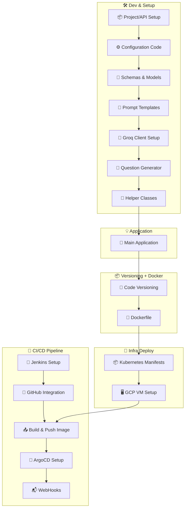
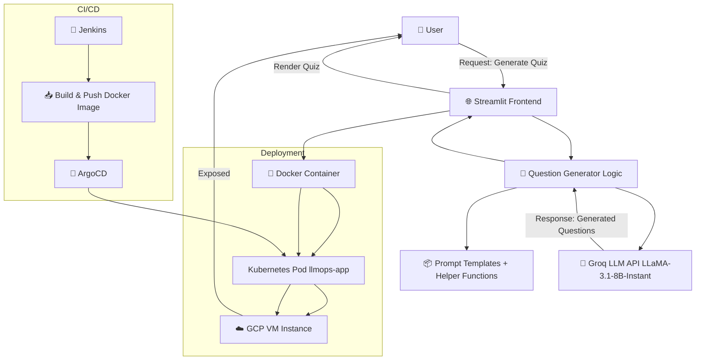

# 📘 AskGenie: AI-Powered Quiz Generator

**AskGenie** is a real-time AI-powered quiz and fill-in-the-blank generation app built using **Groq’s Llama 3.1 (70B)** model (`llama3-70b-8192`). Users can instantly generate topic-specific quizzes by selecting the type, difficulty, and number of questions.
This project follows full **MLOps + LLMOps** best practices — it is containerized with **Docker**, orchestrated using **Kubernetes**, and continuously delivered using **Jenkins + ArgoCD**.

---
## 📚 Table of Contents
- [🔄 Project Workflow ][#-project-workflow]
- [🧱 Project Architecture](#-project-architecture)
- [📌 Features](#-features)
- [🧪 Inputs & Functionality](#-inputs--functionality)
- [🛠️ Tech Stack](#-tech-stack)
- [📸 Project Screenshots](#-project-screenshots)
  - [🔧 Jenkins CI/CD Pipeline](#-jenkins-cicd-pipeline)
  - [🐳 Docker Image Build](#-docker-image-build)
  - [🚀 ArgoCD Deployment](#-argocd-deployment)
  - [🎯 AskGenie App UI – Quiz Generation](#-askgenie-app-ui--quiz-generation)
- [🔧 Prerequisites](#-prerequisites)
- [🧪 Local Setup](#-local-setup)
- [🐳 Docker Build & Run](#-docker-build--run)
- [🛠️ Full CI/CD Deployment Setup Instructions](#️-full-cicd-deployment-setup-instructions)
- [🤝 Contributors](#-contributors)

---

## 🔄 Project Workflow


---

## 🧱 Project Architecture


---

## 📌 Features

- 🔍 **Custom Quiz Generation** – Choose **topic**, **question type** (MCQ/Fill in the Blank), **difficulty**, and **number of questions**
- ⚙️ **Groq LLM Integration** – Uses **Groq API** with `llama3-70b-8192` for fast, context-rich question generation
- 🎯 **Streamlit UI** – Intuitive, responsive interface for a seamless user experience
- 🐳 **Dockerized App** – Lightweight, portable, and production-ready
- ☸️ **Kubernetes Deployment** – Scalable app deployed on **GCP VM** (via Minikube or GKE)
- 🚀 **CI/CD Pipeline** – End-to-end automation with **Jenkins + ArgoCD + GitHub Webhooks**

---

## 🧪 Inputs & Functionality
| Input Field                | Description                               |
| -------------------------- | ----------------------------------------- |
| 🧠 **Question Type**       | MCQ or Fill in the Blank                  |
| 📚 **Topic**               | Subject area like AI, History, Math, etc. |
| 🎯 **Difficulty**          | Easy / Medium / Hard                      |
| 🔢 **Number of Questions** | Choose from 1 to 10                       |

---

## 🛠️ Tech Stack
| Layer                | Tools Used                          |
| -------------------- | ----------------------------------- |
| 💻 **UI**            | Streamlit                           |
| 🧠 **LLM**           | Groq API (`llama3-70b-8192`)        |
| 🧪 **Backend**       | Python (Modular, Functional Design) |
| 🐳 **Container**     | Docker                              |
| ☸️ **Orchestration** | Kubernetes (Minikube / GKE)         |
| 🔧 **CI/CD**         | Jenkins + GitHub + ArgoCD           |
| ☁️ **Cloud**         | Google Cloud VM                     |

---
## 📸 Project Screenshots

### 🔧 Jenkins CI/CD Pipeline

- ✅ **Pipeline Start**

  

- ✅ **Pipeline Success**

  

---

### 🐳 Docker Image Build

- 📦 **Docker Images Built**

  

---

### 🚀 ArgoCD Deployment

- 🔄 **ArgoCD Sync and Health Status**

  

---

### 🎯 AskGenie App UI – Quiz Generation

- 🧠 **MCQ Question Generation – Page 1**

  

- 🧠 **MCQ Question Generation – Page 2**

  

- ✍️ **Fill-in-the-Blank Question Interface**

  

---
## 🔧 Prerequisites
Before running the project, ensure you have the following installed:
- Python 3.11+
- Docker
- Groq API Key (signup at [Groq Cloud](https://console.groq.com/))
- GCP VM or Localhost for deployment
- (Optional) Jenkins, ArgoCD if deploying CI/CD pipeline

## 🧪 Local Setup
```bash
# 1. Clone the repository
git clone https://github.com/aimldinesh/ASKGENIE.git
cd ASKGENIE

# 2. Create virtual environment & activate
python -m venv venv
source venv/bin/activate  # for Linux/macOS
venv\Scripts\activate     # for Windows

# 3. Install dependencies
pip install -e .

# 4. Set up Groq API key
echo "GROQ_API_KEY=your_key_here" > .env

# Run locally
streamlit run app.py
```
--- 

## 🐳 Docker Build & Run
```bash
# Build Docker image
docker build -t askgenie .

# Run container
docker run -p 8501:8501 askgenie
```

---

## 🛠️ Full CI/CD Deployment Setup Instructions
For detailed end-to-end deployment steps—including Docker build, Kubernetes deployment on GCP, Jenkins CI/CD pipeline, GitHub integration, ArgoCD sync, and GitOps automation—check the guide below:

[View Full Setup Instructions →](./complete_setup.md).

Credit: Huge thanks to Data Guru for the full setup documentation that made this deployment seamless.

## 🤝 Contributors
- [Dinesh Chaudhary](https://github.com/aimldinesh)