# 📘 AskGenie: AI-Powered Quiz Generator

**AskGenie** is a real-time AI-powered quiz and fill-in-the-blank generation app built using **Groq’s Llama 3.1 (70B)** model (`llama3-70b-8192`). Users can instantly generate topic-specific quizzes by selecting the type, difficulty, and number of questions.

This project follows full **MLOps + LLMOps** best practices — it is containerized with **Docker**, orchestrated using **Kubernetes**, and continuously delivered using **Jenkins + ArgoCD**.

---

## 📌 Features

- 🔍 **Custom Quiz Generation** – Choose **topic**, **question type** (MCQ/Fill in the Blank), **difficulty**, and **number of questions**
- ⚙️ **Groq LLM Integration** – Uses **Groq API** with `llama3-70b-8192` for fast, context-rich question generation
- 🎯 **Streamlit UI** – Intuitive, responsive interface for a seamless user experience
- 🐳 **Dockerized App** – Lightweight, portable, and production-ready
- ☸️ **Kubernetes Deployment** – Scalable app deployed on **GCP VM** (via Minikube or GKE)
- 🚀 **CI/CD Pipeline** – End-to-end automation with **Jenkins + ArgoCD + GitHub Webhooks**

---

## 🧱 Project Architecture

```mermaid
flowchart TD
    subgraph "🛠️ Development & Setup"
        A1[📦 Project/API Setup]
        A2[⚙️ Configuration Code]
        A3[📄 Schemas & Models]
        A4[📝 Prompt Templates]
        A5[🔌 Groq Client Setup]
        A6[🧠 Question Generator]
        A7[🧰 Helper Classes]
        A1 --> A2 --> A3 --> A4 --> A5 --> A6 --> A7
    end

    subgraph "💡 Application"
        B1[🧪 Main Application]
    end

    subgraph "📦 Versioning & Containerization"
        C1[📂 Code Versioning]
        C2[🐳 Dockerfile]
        C1 --> C2
    end

    subgraph "🚀 Infrastructure Deployment"
        D1[📦 Kubernetes Manifests]
        D2[🖥️ GCP VM Setup]
        D1 --> D2
    end

    subgraph "🔁 CI/CD Pipeline"
        E1[🔧 Jenkins Setup]
        E2[🔗 GitHub Integration]
        E3[📤 Build & Push Image]
        E4[🚦 ArgoCD Setup]
        E5[📬 WebHooks]
        E1 --> E2 --> E3 --> E4 --> E5
    end

    A7 --> B1
    B1 --> C1
    C2 --> D1
    D2 --> E3
```


---

## 🧪 Inputs & Functionality
| Input Field                | Description                               |
| -------------------------- | ----------------------------------------- |
| 🧠 **Question Type**       | MCQ or Fill in the Blank                  |
| 📚 **Topic**               | Subject area like AI, History, Math, etc. |
| 🎯 **Difficulty**          | Easy / Medium / Hard                      |
| 🔢 **Number of Questions** | Choose from 1 to 10                       |

---

## 🛠️ Tech Stack
| Layer                | Tools Used                          |
| -------------------- | ----------------------------------- |
| 💻 **UI**            | Streamlit                           |
| 🧠 **LLM**           | Groq API (`llama3-70b-8192`)        |
| 🧪 **Backend**       | Python (Modular, Functional Design) |
| 🐳 **Container**     | Docker                              |
| ☸️ **Orchestration** | Kubernetes (Minikube / GKE)         |
| 🔧 **CI/CD**         | Jenkins + GitHub + ArgoCD           |
| ☁️ **Cloud**         | Google Cloud VM                     |

---
## 📸 Screenshots

### 🧠 Quiz Generation UI


### 🚦 ArgoCD Sync Status


---
## 🧪 Local Setup
```bash
# 1. Clone the repository
git clone https://github.com/yourusername/AskGenie.git
cd AskGenie

# 2. Create virtual environment & activate
python -m venv venv
source venv/bin/activate  # for Linux/macOS
venv\Scripts\activate     # for Windows

# 3. Install dependencies
pip install -e .

# 4. Set up Groq API key
echo "GROQ_API_KEY=your_key_here" > .env

# Run locally
streamlit run app.py
```
--- 

## 🐳 Docker Build & Run
```bash
# Build Docker image
docker build -t askgenie .

# Run container
docker run -p 8501:8501 askgenie
```

## 🛠️ Full Setup Instructions

For full setup and deployment instructions, check out the [complete_setup_instruction.md](./complete_setup_instruction.md) file.


